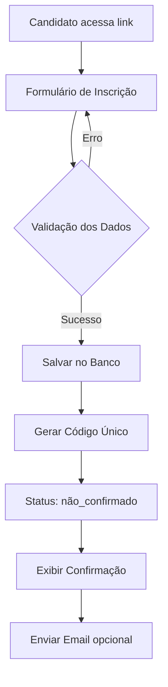
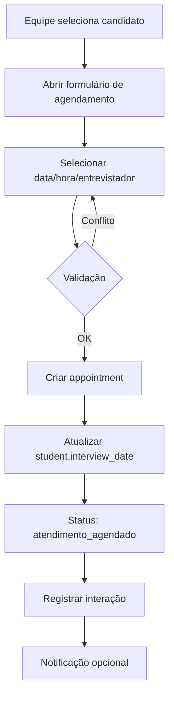
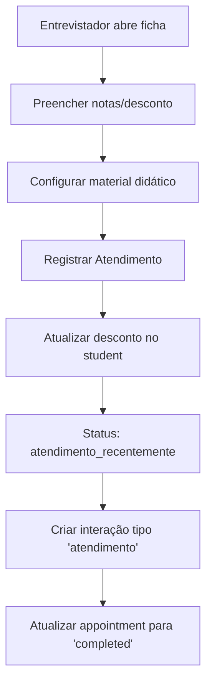

# 🔧 Guia Técnico - Sistema de Gestão de Inscrições

> **Documentação técnica detalhada para desenvolvedores**

---

## 📋 Índice

- [Arquitetura do Sistema](#-arquitetura-do-sistema)
- [Stack Tecnológico](#-stack-tecnológico)
- [Estrutura de Dados](#-estrutura-de-dados)
- [Fluxos Principais](#-fluxos-principais)
- [Segurança](#-segurança)
- [Otimizações e Performance](#-otimizações-e-performance)
- [Desenvolvimento](#-desenvolvimento)
- [Deploy](#-deploy)
- [Troubleshooting](#-troubleshooting)

---

## 🏗️ Arquitetura do Sistema

### **Arquitetura Geral**

```
┌─────────────────────────────────────────────────────┐
│                    Frontend (SPA)                    │
│                                                       │
│  ┌──────────────┐  ┌──────────────┐  ┌───────────┐ │
│  │   React 18   │  │  TypeScript  │  │ Tailwind  │ │
│  └──────────────┘  └──────────────┘  └───────────┘ │
│                                                       │
│  ┌──────────────────────────────────────────────┐  │
│  │         React Router (Client-side)           │  │
│  └──────────────────────────────────────────────┘  │
└─────────────────────────────────────────────────────┘
                          │
                          │ HTTPS/REST API
                          │
┌─────────────────────────────────────────────────────┐
│                  Supabase (BaaS)                     │
│                                                       │
│  ┌──────────────┐  ┌──────────────┐  ┌───────────┐ │
│  │  PostgreSQL  │  │     Auth     │  │    RLS    │ │
│  └──────────────┘  └──────────────┘  └───────────┘ │
│                                                       │
│  ┌──────────────┐  ┌──────────────┐                │
│  │   Realtime   │  │    Storage   │                │
│  └──────────────┘  └──────────────┘                │
└─────────────────────────────────────────────────────┘
```

### **Padrões Arquiteturais**

- **Component-Based Architecture** - Componentes React modulares e reutilizáveis
- **Composition Pattern** - Composição de componentes menores
- **Custom Hooks** - Lógica reutilizável em hooks
- **Smart/Dumb Components** - Separação entre componentes de lógica e apresentação
- **BaaS (Backend as a Service)** - Backend gerenciado pelo Supabase

---

## 💻 Stack Tecnológico

### **Frontend**

#### **React 18.3.1**
- Framework principal para UI
- Hooks para gerenciamento de estado
- Suspense para carregamento assíncrono

**Principais conceitos utilizados:**
```typescript
// Custom Hook exemplo
const useStudent = (id: string) => {
  const [student, setStudent] = useState<Student | null>(null);
  const [loading, setLoading] = useState(true);
  
  useEffect(() => {
    fetchStudent(id);
  }, [id]);
  
  return { student, loading };
};
```

#### **TypeScript 5.5.3**
- Type safety em todo o código
- Interfaces para tipos de dados do Supabase
- Genéricos para componentes reutilizáveis

**Exemplo de tipagem:**
```typescript
type Student = Tables<'students'> & {
  classes: Tables<'classes'> & {
    units: Tables<'units'>;
    series: Tables<'series'>;
  };
};
```

#### **TailwindCSS 3.4.11**
- Utility-first CSS framework
- Design responsivo
- Dark mode ready
- Custom theme configurado

#### **Shadcn/ui**
- Componentes UI acessíveis (ARIA)
- Baseados em Radix UI
- Customizáveis
- Componentes principais: Dialog, Select, Table, Card, Badge, etc.

### **Backend**

#### **Supabase**
- **PostgreSQL** - Banco de dados relacional
- **PostgREST** - API REST automática
- **GoTrue** - Sistema de autenticação
- **Realtime** - Subscriptions em tempo real (não usado atualmente)
- **Edge Functions** - Serverless functions

**Estrutura de conexão:**
```typescript
import { createClient } from '@supabase/supabase-js';

export const supabase = createClient(
  import.meta.env.VITE_SUPABASE_URL,
  import.meta.env.VITE_SUPABASE_ANON_KEY
);
```

---

## 🗄️ Estrutura de Dados

### **Principais Tabelas**

#### **`profiles`** - Usuários do Sistema
```sql
CREATE TABLE profiles (
  id UUID PRIMARY KEY REFERENCES auth.users,
  name TEXT NOT NULL,
  email TEXT NOT NULL,
  profile user_profile NOT NULL DEFAULT 'padrao',
  unit_id UUID REFERENCES units,
  ativo BOOLEAN NOT NULL DEFAULT true,
  created_at TIMESTAMP WITH TIME ZONE DEFAULT NOW()
);
```

**Enums:**
- `user_profile`: 'admin' | 'direcao' | 'entrevistador' | 'padrao'

#### **`units`** - Unidades Escolares
```sql
CREATE TABLE units (
  id UUID PRIMARY KEY DEFAULT uuid_generate_v4(),
  name TEXT NOT NULL,
  address TEXT NOT NULL,
  phone TEXT NOT NULL,
  city TEXT,
  slug TEXT UNIQUE NOT NULL,
  created_at TIMESTAMP WITH TIME ZONE DEFAULT NOW()
);
```

#### **`series`** - Séries/Anos Escolares
```sql
CREATE TABLE series (
  id UUID PRIMARY KEY DEFAULT uuid_generate_v4(),
  name TEXT NOT NULL,
  order_index INTEGER NOT NULL,
  created_at TIMESTAMP WITH TIME ZONE DEFAULT NOW()
);
```

#### **`classes`** - Turmas
```sql
CREATE TABLE classes (
  id UUID PRIMARY KEY DEFAULT uuid_generate_v4(),
  name TEXT NOT NULL,
  unit_id UUID NOT NULL REFERENCES units,
  series_id UUID NOT NULL REFERENCES series,
  monthly_fee DECIMAL(10,2) NOT NULL,
  material_didatico_anual DECIMAL(10,2),
  material_didatico_mes DECIMAL(10,2),
  created_at TIMESTAMP WITH TIME ZONE DEFAULT NOW()
);
```

#### **`students`** - Candidatos/Alunos
```sql
CREATE TABLE students (
  id UUID PRIMARY KEY DEFAULT uuid_generate_v4(),
  code TEXT UNIQUE NOT NULL,
  student_name TEXT NOT NULL,
  responsible_name TEXT NOT NULL,
  birth_date DATE NOT NULL,
  phone TEXT NOT NULL,
  email TEXT NOT NULL,
  city TEXT NOT NULL,
  neighborhood TEXT NOT NULL,
  origin_school TEXT NOT NULL,
  class_id UUID NOT NULL REFERENCES classes,
  exam_date DATE,
  exam_date_id UUID REFERENCES exam_dates,
  interview_date DATE,
  status student_status NOT NULL DEFAULT 'nao_confirmado',
  discount_percentage INTEGER DEFAULT 0,
  discount_material INTEGER DEFAULT 0,
  material_payment_type material_payment,
  material_installments INTEGER,
  material_parcela DECIMAL(10,2),
  dropout_reason dropout_reason,
  dropout_comment TEXT,
  invalid_reason TEXT,
  registration_source TEXT,
  created_at TIMESTAMP WITH TIME ZONE DEFAULT NOW()
);
```

**Enums de Status:**
```sql
CREATE TYPE student_status AS ENUM (
  'nao_confirmado',
  'confirmado',
  'cadastro_invalido',
  'matriculado',
  'desistente',
  'nenhum_agendamento',
  'atendimento_agendado',
  'faltou_ao_atendimento',
  'atendimento_recentemente',
  'atendimento_ha_mais_de_uma_semana',
  'ausente',
  'processo_anos_anteriores'
);
```

#### **`appointments`** - Agendamentos
```sql
CREATE TABLE appointments (
  id UUID PRIMARY KEY DEFAULT uuid_generate_v4(),
  student_id UUID NOT NULL REFERENCES students,
  interviewer_id UUID NOT NULL REFERENCES profiles,
  appointment_date DATE NOT NULL,
  appointment_time TIME NOT NULL,
  formato_entrevista TEXT DEFAULT 'presencial',
  status TEXT DEFAULT 'scheduled',
  created_at TIMESTAMP WITH TIME ZONE DEFAULT NOW()
);
```

#### **`student_interactions`** - Histórico de Interações
```sql
CREATE TABLE student_interactions (
  id UUID PRIMARY KEY DEFAULT uuid_generate_v4(),
  student_id UUID NOT NULL REFERENCES students,
  user_id UUID REFERENCES profiles,
  interaction_type TEXT NOT NULL,
  comments TEXT,
  created_at TIMESTAMP WITH TIME ZONE DEFAULT NOW()
);
```

**Tipos de interação:**
- `comentario` - Comentário geral
- `atendimento` - Registro de atendimento
- `mudanca_status` - Mudança de status
- `agendamento_entrevista` - Agendamento
- `mudanca_turma` - Alteração de turma
- `mudanca_data_prova` - Alteração de data de prova
- `dados_pessoais_alterados` - Edição de dados pessoais

#### **`exam_dates`** - Datas de Provas
```sql
CREATE TABLE exam_dates (
  id UUID PRIMARY KEY DEFAULT uuid_generate_v4(),
  unit_id UUID NOT NULL REFERENCES units,
  exam_date DATE NOT NULL,
  exam_time TIME NOT NULL,
  created_at TIMESTAMP WITH TIME ZONE DEFAULT NOW()
);
```

---

## 🔄 Fluxos Principais

### **1. Fluxo de Inscrição**



**Código simplificado:**
```typescript
const handleSubmit = async (data: FormData) => {
  // 1. Sanitizar dados
  const sanitizedData = sanitizeFormData(data);
  
  // 2. Gerar código único
  const code = generateStudentCode();
  
  // 3. Inserir no banco
  const { data: student, error } = await supabase
    .from('students')
    .insert({
      ...sanitizedData,
      code,
      status: 'nao_confirmado'
    })
    .select()
    .single();
    
  // 4. Confirmar ao usuário
  toast.success('Inscrição realizada com sucesso!');
};
```

### **2. Fluxo de Agendamento**



### **3. Fluxo de Atendimento**



**Código simplificado:**
```typescript
const handleRegisterAttendance = async () => {
  // 1. Atualizar appointment (se existe)
  if (currentAppointment) {
    await supabase
      .from('appointments')
      .update({ status: 'completed' })
      .eq('id', currentAppointment.id);
  }
  
  // 2. Atualizar dados do student
  await supabase
    .from('students')
    .update({
      discount_percentage: discount,
      discount_material: materialDiscount,
      material_payment_type: paymentType,
      material_installments: installments,
      status: 'atendimento_recentemente'
    })
    .eq('id', studentId);
    
  // 3. Registrar interação
  await supabase
    .from('student_interactions')
    .insert({
      student_id: studentId,
      user_id: userId,
      interaction_type: 'atendimento',
      comments: `Atendimento realizado. Desconto: ${discount}%...`
    });
};
```

---

## 🔐 Segurança

### **Row Level Security (RLS)**

O Supabase implementa segurança a nível de linha. Cada tabela tem políticas RLS:

#### **Exemplo: Políticas para `students`**

```sql
-- Política de leitura: todos autenticados podem ler
CREATE POLICY "Authenticated users can read students"
  ON students FOR SELECT
  USING (auth.role() = 'authenticated');

-- Política de inserção: apenas pelo formulário público ou autenticados
CREATE POLICY "Anyone can insert students"
  ON students FOR INSERT
  WITH CHECK (true);

-- Política de atualização: apenas autenticados
CREATE POLICY "Authenticated users can update students"
  ON students FOR UPDATE
  USING (auth.role() = 'authenticated')
  WITH CHECK (auth.role() = 'authenticated');
```

#### **Políticas para `profiles`**

```sql
-- Admins podem atualizar qualquer profile
CREATE POLICY "Admins can update all profiles"
  ON profiles FOR UPDATE
  USING (
    EXISTS (
      SELECT 1 FROM profiles
      WHERE profiles.id = auth.uid()
      AND profiles.profile = 'admin'
    )
  );

-- Usuários podem ver apenas profiles ativos
CREATE POLICY "Users can read active profiles"
  ON profiles FOR SELECT
  USING (ativo = true);
```

### **Sanitização de Dados**

Todos os inputs são sanitizados antes de salvar no banco:

```typescript
// utils/sanitization.ts
import DOMPurify from 'dompurify';

export const sanitizePlainText = (text: string): string => {
  return DOMPurify.sanitize(text, { ALLOWED_TAGS: [] });
};

export const sanitizePhone = (phone: string): string => {
  return phone.replace(/[^\d\s\-\(\)\+]/g, '');
};

export const sanitizeEmail = (email: string): string => {
  const sanitized = email.toLowerCase().trim();
  const emailRegex = /^[^\s@]+@[^\s@]+\.[^\s@]+$/;
  return emailRegex.test(sanitized) ? sanitized : '';
};
```

### **Autenticação**

```typescript
// hooks/useAuth.tsx
export const useAuth = () => {
  const [user, setUser] = useState<User | null>(null);
  const [profile, setProfile] = useState<Profile | null>(null);

  useEffect(() => {
    // Verificar sessão atual
    supabase.auth.getSession().then(({ data: { session } }) => {
      setUser(session?.user ?? null);
      if (session?.user) {
        fetchProfile(session.user.id);
      }
    });

    // Escutar mudanças de autenticação
    const { data: { subscription } } = supabase.auth.onAuthStateChange(
      (_event, session) => {
        setUser(session?.user ?? null);
        if (session?.user) {
          fetchProfile(session.user.id);
        } else {
          setProfile(null);
        }
      }
    );

    return () => subscription.unsubscribe();
  }, []);

  return { user, profile };
};
```

---

## ⚡ Otimizações e Performance

### **1. Code Splitting**

Vite automaticamente faz code splitting, mas podemos otimizar com lazy loading:

```typescript
import { lazy, Suspense } from 'react';

const StudentProfile = lazy(() => import('./pages/StudentProfile'));

// No Router
<Route 
  path="/student/:id" 
  element={
    <Suspense fallback={<Loading />}>
      <StudentProfile />
    </Suspense>
  } 
/>
```

### **2. Memoização**

```typescript
import { useMemo, useCallback } from 'react';

const StudentsTab = () => {
  // Memoizar cálculos pesados
  const filteredStudents = useMemo(() => {
    return students.filter(student => 
      student.name.toLowerCase().includes(search.toLowerCase())
    );
  }, [students, search]);

  // Memoizar callbacks
  const handleEdit = useCallback((student: Student) => {
    setEditingStudent(student);
  }, []);
};
```

### **3. Queries Otimizadas**

```typescript
// ❌ Ruim: Múltiplas queries
const student = await supabase.from('students').select('*').eq('id', id);
const classData = await supabase.from('classes').select('*').eq('id', student.class_id);

// ✅ Bom: Join em uma query
const { data } = await supabase
  .from('students')
  .select(`
    *,
    classes!inner(
      *,
      units(*),
      series(*)
    )
  `)
  .eq('id', id)
  .single();
```

### **4. Paginação**

```typescript
const fetchStudents = async (page: number, pageSize: number = 50) => {
  const from = page * pageSize;
  const to = from + pageSize - 1;

  const { data, count } = await supabase
    .from('students')
    .select('*', { count: 'exact' })
    .range(from, to)
    .order('created_at', { ascending: false });

  return { data, count };
};
```

---

## 🛠️ Desenvolvimento

### **Estrutura de Commits**

Seguimos Conventional Commits:

```
feat: adiciona filtro por data de inscrição
fix: corrige cálculo de desconto no material
docs: atualiza README com novas funcionalidades
style: ajusta espaçamento na tabela de usuários
refactor: reorganiza componentes de formulário
test: adiciona testes para validação de CPF
chore: atualiza dependências
```

### **Convenções de Código**

#### **Nomenclatura de Componentes**
```typescript
// PascalCase para componentes
export const StudentDialog = () => { ... };

// camelCase para funções e variáveis
const handleSubmit = () => { ... };
const userData = { ... };

// UPPER_SNAKE_CASE para constantes
const MAX_STUDENTS_PER_PAGE = 50;
```

#### **Estrutura de Componentes**
```typescript
// 1. Imports
import { useState, useEffect } from 'react';
import { supabase } from '@/integrations/supabase/client';

// 2. Types
type Props = {
  studentId: string;
  onClose: () => void;
};

// 3. Component
export const StudentDialog = ({ studentId, onClose }: Props) => {
  // 3.1. States
  const [student, setStudent] = useState<Student | null>(null);
  const [loading, setLoading] = useState(true);

  // 3.2. Effects
  useEffect(() => {
    fetchStudent();
  }, [studentId]);

  // 3.3. Functions
  const fetchStudent = async () => { ... };
  const handleSubmit = async () => { ... };

  // 3.4. Render
  return ( ... );
};
```

### **Custom Hooks**

```typescript
// hooks/useStudents.ts
export const useStudents = (filters?: StudentFilters) => {
  const [students, setStudents] = useState<Student[]>([]);
  const [loading, setLoading] = useState(true);
  const [error, setError] = useState<Error | null>(null);

  const fetchStudents = useCallback(async () => {
    try {
      setLoading(true);
      const { data, error } = await supabase
        .from('students')
        .select('*')
        .order('created_at', { ascending: false });

      if (error) throw error;
      setStudents(data || []);
    } catch (err) {
      setError(err as Error);
    } finally {
      setLoading(false);
    }
  }, [filters]);

  useEffect(() => {
    fetchStudents();
  }, [fetchStudents]);

  return { students, loading, error, refetch: fetchStudents };
};
```

---

## 🚀 Deploy

### **Opção 1: Vercel (Recomendado)**

1. Conecte seu repositório Git
2. Configure variáveis de ambiente
3. Deploy automático em cada push

```bash
# Instalar CLI da Vercel
npm install -g vercel

# Deploy
vercel
```

### **Opção 2: Netlify**

```bash
# Build
npm run build

# Deploy na Netlify
netlify deploy --prod --dir=dist
```

### **Variáveis de Ambiente no Produção**

```env
VITE_SUPABASE_URL=https://seu-projeto.supabase.co
VITE_SUPABASE_ANON_KEY=sua-chave-publica
```

---

## 🐛 Troubleshooting

### **Problema: Usuários não conseguem atualizar dados**

**Causa:** Row Level Security bloqueando
**Solução:** Verificar políticas RLS no Supabase

```sql
-- Ver políticas atuais
SELECT * FROM pg_policies WHERE tablename = 'nome_tabela';
```

### **Problema: Data exibida errada**

**Causa:** Timezone do banco vs cliente
**Solução:** Usar funções utilitárias

```typescript
// utils/dateUtils.ts
export const getCurrentDate = (): string => {
  return new Date().toISOString().split('T')[0];
};

export const formatDateForDisplay = (date: string): string => {
  return new Date(date + 'T00:00:00').toLocaleDateString('pt-BR');
};
```

### **Problema: Build falha**

**Causa:** Variáveis de ambiente faltando
**Solução:**
```bash
# Verificar se .env existe
cat .env

# Copiar de exemplo
cp .env.example .env
```

---

## 📚 Recursos Adicionais

- [Documentação do React](https://react.dev)
- [Documentação do TypeScript](https://www.typescriptlang.org/docs)
- [Documentação do Supabase](https://supabase.com/docs)
- [TailwindCSS](https://tailwindcss.com/docs)
- [Shadcn/ui](https://ui.shadcn.com)

---

**Desenvolvido com TypeScript, React e Supabase** 🚀

